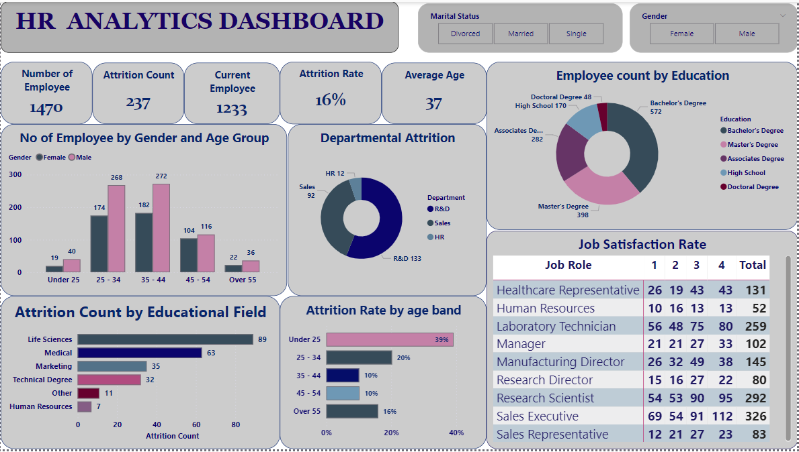

# HR Analytics Dashboard

## Overview: 
This Power BI dashboard analyzes key HR metrics. It helps identify trends in employee demographics, performance, and turnover rates aiming to help HR departments make data-driven decisions.

## Data Description
- Data includes attrition, business travel, cf age band, cf attrition label, department, education field, employee number, gender, job role, marital status, age, cf current employee, education, employee count, job satisfaction.

## Technologies Used:

- **Power BI**: For data visualization.
- **GitHub**: For documentation.

## Key Features:

- **Attrition Rate:**
  This shows trends in employee attrition, helping HR to identify peak periods of turnover.
  
- **Attrition by Department:**
The chart tyoe is Donut Chart. This allows for comparison of attrition rates across different departments, highlighting areas that may require further investigation.

- **Job Satisfaction vs Job Role:**
Using a matrix table,this visualization illustrate the correlation between job satisfaction scores and the job role, showcasing how dissatisfaction affects employee retention.

- **Attrition Count by Educational Field:**
Using a Clustered Bar Chart. This helps to determine number of employees that left by the educational field.

- **Attrition Rate by Age Band:**
Using the Stacked Bar Chart, it breaks down attrition rates across various age bands, identifying whether younger or older employees are leaving at higher rates.

## Dashboard

## Insights

1. **High Turnover in Specific Departments:** The dashboard reveals that the R & D department has the highest attrition rate, indicating a potential need for departmental reviews.

2. **Job Satisfaction Correlation:** Data analysis indicates a negative correlation between job satisfaction and attrition; employees with lower satisfaction scores are more likely to leave.

3. **Demographic Trends:** Insights into the age bands show that the Under 25 age group has a notably higher attrition rate, prompting HR to investigate potential causes specific to this demographic.

## Conclusion
The insights derived from the Employee Attrition Analysis Dashboard can be instrumental for HR decision-making. By understanding the factors influencing employee turnover, HR teams can create targeted strategies to improve job satisfaction and reduce attrition rates across the organization.

  

